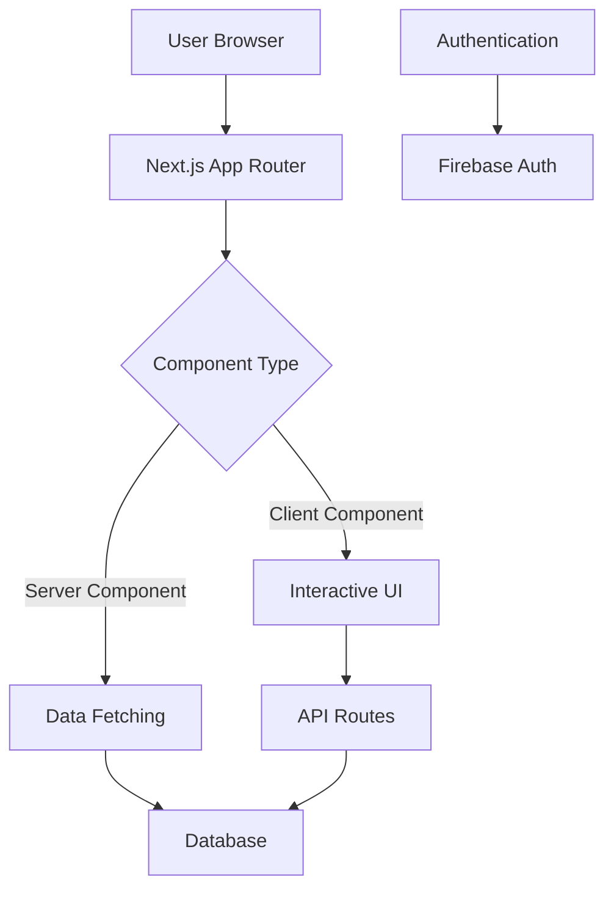

# Disney Vacation Planning Documentation

This documentation provides comprehensive information about the Disney Vacation Planning application architecture, components, and usage guides.

## Table of Contents

1. [Architecture](#architecture)
2. [Components](#components)
3. [API Documentation](#api-documentation)
4. [Guides](#guides)
5. [Developer Portal](#developer-portal)

## Architecture

The Disney Vacation Planning application is built with Next.js 15 using the App Router with a mix of server and client components. The architecture follows these principles:

- **Server Components**: Used for data fetching and rendering static content
- **Client Components**: Used for interactive UI elements
- **API Routes**: RESTful endpoints following standardized response formats
- **Database**: Firebase for real-time data and authentication

### Architecture Diagram



## Components

The application uses a component-based architecture with Shadcn UI and Radix UI for accessible components. Components are organized by feature domain:

- **UI Components**: Base UI components with consistent styling
- **Feature Components**: Domain-specific components like attractions, dining, resorts
- **Layout Components**: Page layouts and navigation elements
- **Form Components**: Input elements and validation

### Component Usage

Each component is documented with:
- Purpose and description
- Props API
- Usage examples
- Variants and configurations

[View Component API Documentation →](/docs/components/index.html)

## API Documentation

The API follows RESTful principles with standardized response formats. All endpoints are documented with:

- Endpoint URL
- HTTP method
- Request parameters
- Response format
- Error handling
- Rate limiting information

[View API Documentation →](/docs/api/index.html)

## Guides

### For Developers

- [Setting up the development environment](/docs/guides/developer/setup.md)
- [Contributing to the project](/docs/guides/developer/contributing.md)
- [Code style and standards](/docs/guides/developer/code-style.md)
- [Testing strategies](/docs/guides/developer/testing.md)
- [Deployment process](/docs/guides/developer/deployment.md)

### For Users

- [Getting started with vacation planning](/docs/guides/user/getting-started.md)
- [Planning Disney attractions](/docs/guides/user/attractions.md)
- [Dining reservations](/docs/guides/user/dining.md)
- [Using the itinerary optimizer](/docs/guides/user/optimizer.md)
- [Group vacation coordination](/docs/guides/user/group-planning.md)

## Developer Portal

The Developer Portal provides a centralized location for all documentation, tools, and resources needed for developers working on the project.

[Access Developer Portal →](/docs/developer-portal/index.html)

---

## Documentation Generation

This documentation is generated using TypeDoc with Markdown support. To generate or update the documentation:

```bash
# Generate documentation
npm run docs:generate

# Serve documentation locally
npm run docs:serve
```