# Disney Vacation Planning Architecture

This document provides a comprehensive overview of the Disney Vacation Planning application architecture, detailing key components, data flow, and system interactions.

## System Architecture Overview

The application is built as a modern web application using Next.js 15, leveraging both server and client components for optimal performance and user experience.

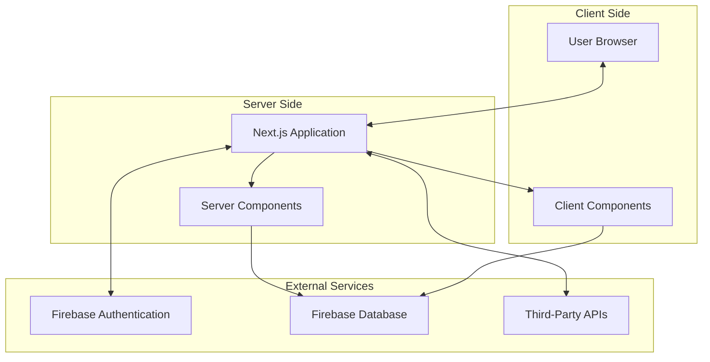

## Core Components

### Frontend Architecture

The frontend architecture follows the Next.js App Router pattern, with a mix of server and client components.

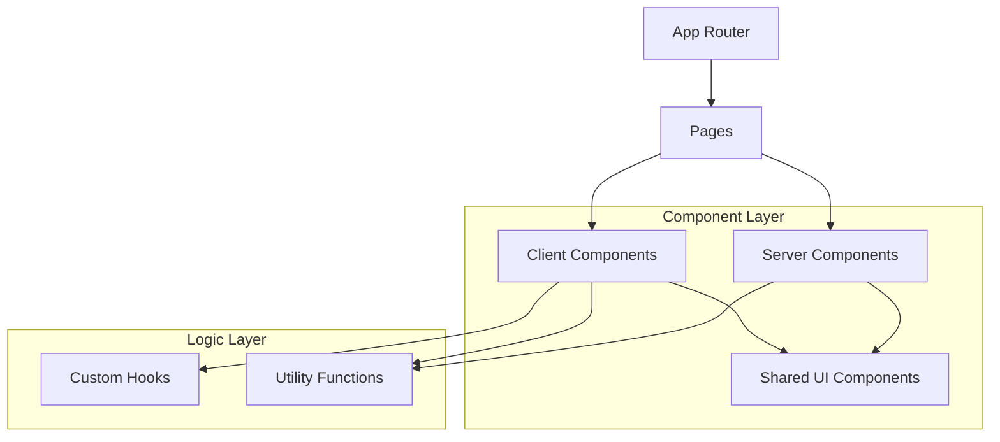

### Data Flow Architecture

Data flows through the application in the following manner:

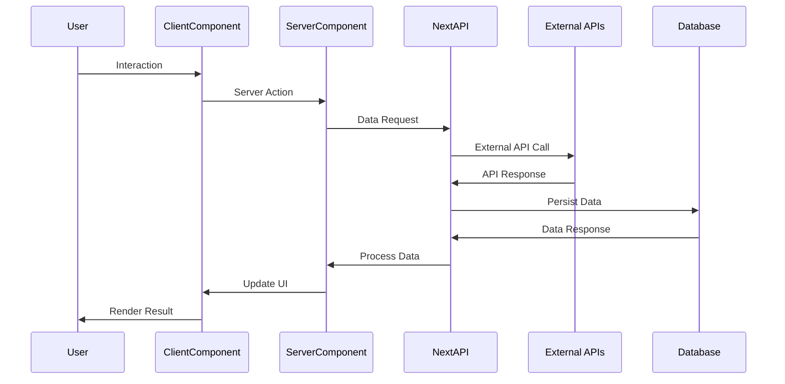

## Key Modules

### Authentication Module

Handles user authentication and authorization using Firebase Authentication.

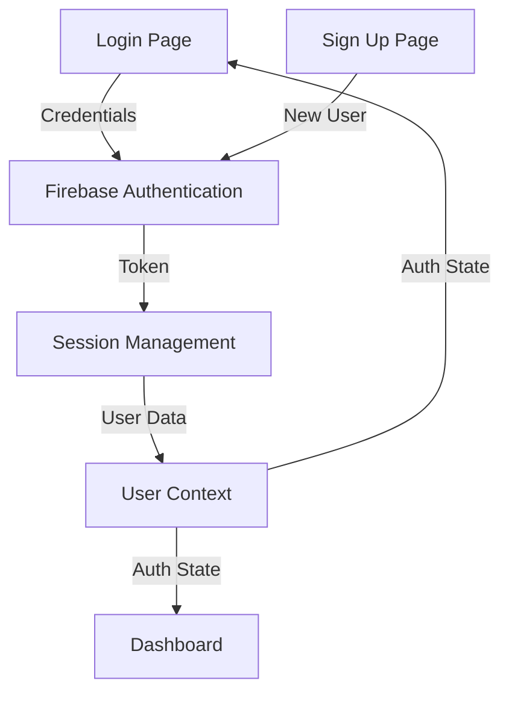

### Optimizer Module

The core planning engine that generates optimized park itineraries.

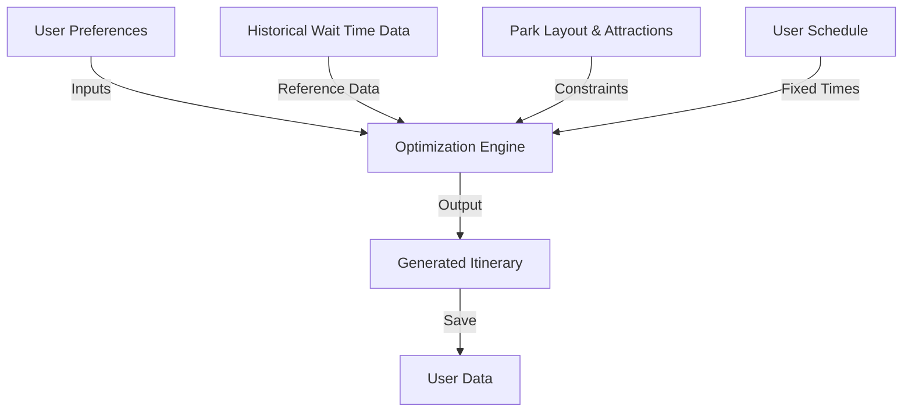

### Maps & Navigation Module

Provides interactive park maps and navigation guidance.

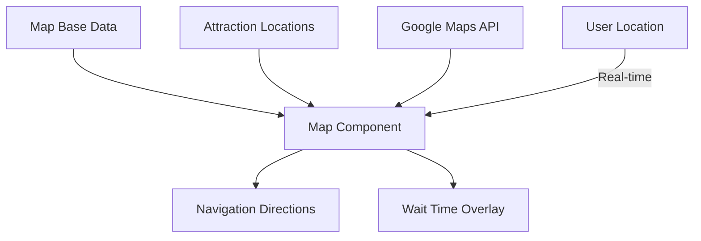

## Database Schema

The application uses Firebase for data storage with the following main collections:

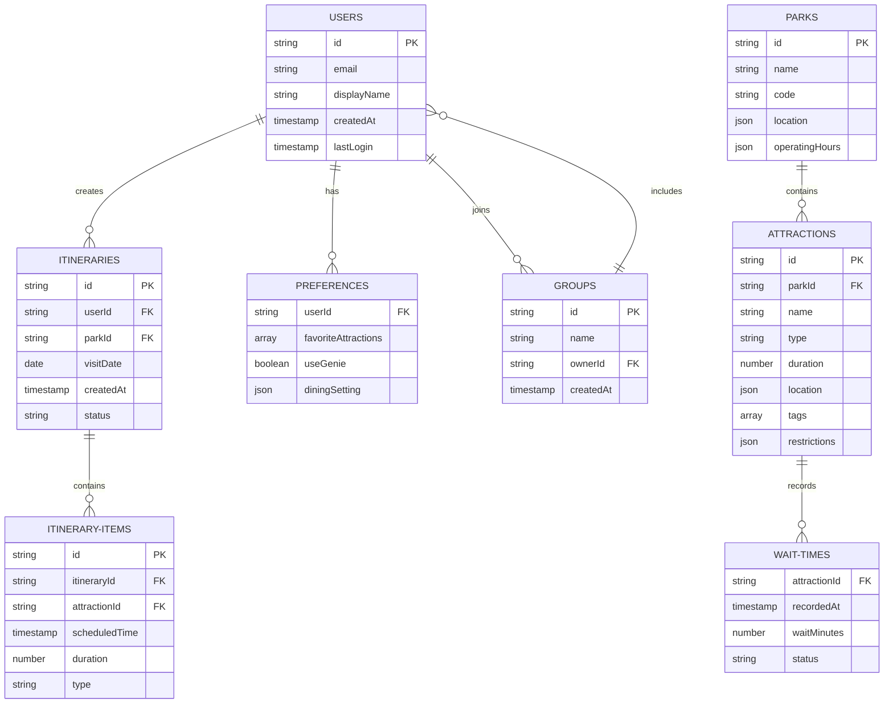

## API Integration Architecture

The application integrates with several APIs to provide comprehensive planning capabilities:

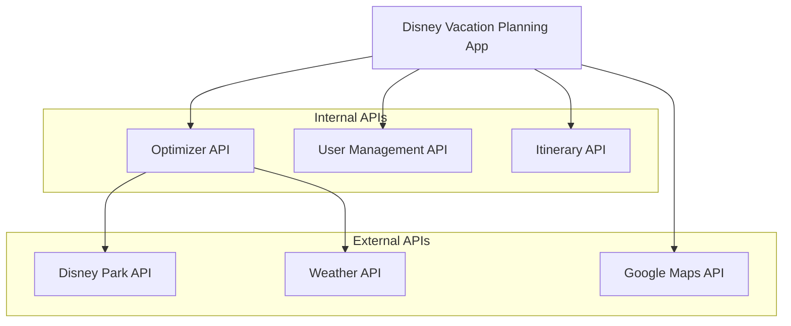

## Deployment Architecture

The application is deployed using a modern cloud infrastructure:

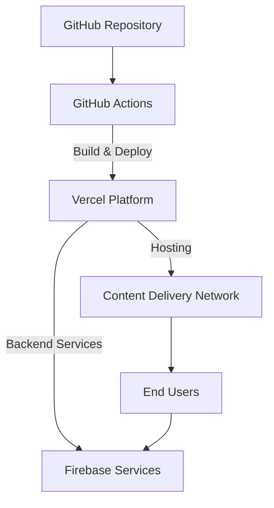

## Security Architecture

The application implements multiple layers of security:

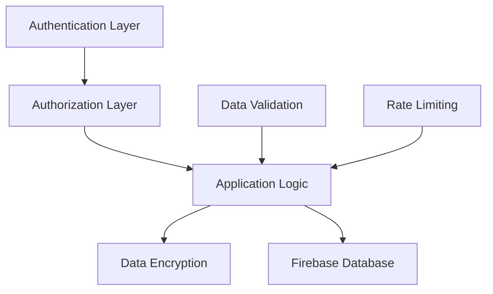

## Monitoring and Logging

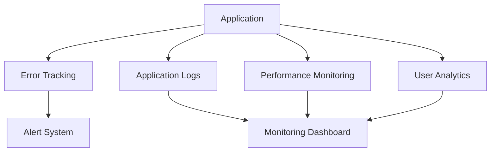

## Technology Stack

- **Frontend**: Next.js 15, React 19, TypeScript
- **Styling**: Tailwind CSS, Shadcn UI, Radix UI
- **State Management**: React Query, Zustand
- **Authentication**: Firebase Authentication
- **Database**: Firebase Firestore
- **APIs**: Next.js API Routes, Firebase Cloud Functions
- **Deployment**: Vercel, Firebase Hosting
- **Maps**: Google Maps API
- **Testing**: Jest, React Testing Library

## Future Architecture Considerations

- Microservices for specific high-load features like the optimizer
- Enhanced caching with Redis for frequently accessed data
- GraphQL API for more efficient data fetching
- Mobile application with shared business logic
- Serverless functions for better scaling